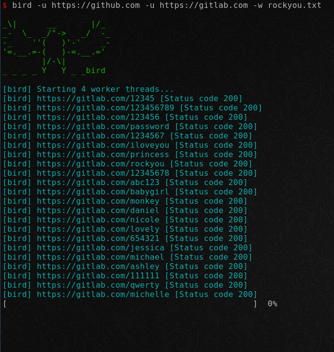

[![Issues][issues-shield]][issues-url]

<!-- PROJECT LOGO -->
<br />
<p align="center">
  <!-- <a href="https://github.com/roerohan/bird">
    
  </a> -->

  <h1 align="center">bird</h1>

  <p align="center">
    A simple website directory enumeration tool built with `golang`.
    <br />
    <a href="https://github.com/roerohan/bird"><strong>Explore the docs »</strong></a>
    <br />
    <br />
    <a href="https://github.com/roerohan/bird">View Demo</a>
    ·
    <a href="https://github.com/roerohan/bird/issues">Report Bug</a>
    ·
    <a href="https://github.com/roerohan/bird/issues">Request Feature</a>
  </p>
</p>


<!-- TABLE OF CONTENTS -->
## Table of Contents

* [About the Project](#about-the-project)
  * [Built With](#built-with)
* [Getting Started](#getting-started)
  * [Prerequisites](#prerequisites)
  * [Installation](#installation)
* [Usage](#usage)
* [Roadmap](#roadmap)
* [Contributing](#contributing)
* [License](#license)
* [Contributors](#contributors-)


<!-- ABOUT THE PROJECT -->
## About The Project

`bird` is a simple, multithreaded website directory enumeration tool. `bird` takes a list of URLs, a list of status codes which represent that the enumeration was successful, and a wordlist for fuzzing. Then, it can _parallely_ enumerate routes on all the URLs with words from the wordlist provided and report the route which returned one of the success codes.

<p align="center">

</p>


### Built With

* [Golang](https://golang.org/)


<!-- GETTING STARTED -->
## Getting Started

To get a local copy up and running follow these simple steps.

### Prerequisites

To build a binary from source, you need the go runtime. Otherwise, you can just get the binary from the [GitHub release](https://github.com/roerohan/bird/releases/).
* golang


### Installation

You can get the binary for your Operating System directly using `wget`, or download it from the [GitHub releases](https://github.com/roerohan/bird/releases/).

```
wget https://github.com/roerohan/bird/releases/download/v0.1.3/bird
```

If you want to get it using the `go` CLI, follow the steps below.

1. Get the package using `go get`.
```sh
go get github.com/roerohan/bird
```

Alternatively, you can clone the repository and build it from source.

1. Clone the Repo
```sh
git clone https://github.com/roerohan/bird.git
```
2. Install NPM packages
```sh
cd bird
go build -o ./bin/bird
```
3. Use the binary inside the bin folder.
```sh
./bin/bird -u https://github.com -s 200 -w ./wordlist/common.txt
```


<!-- USAGE EXAMPLES -->
## Usage

```
Usage of bird:
  -s value
        Status code for success, default 200
  -u value
        Target URL to be bruteforced [required]
  -w string
        Path to wordlist [required]
```

A sample wordlist is provided [here](./wordlist/comon.txt).

An advantage of using `bird` is that you can fuzz multiple websites in parallel, as you can see in the second example below.

### Examples

1. To enumerate `https://github.com` with success codes 200, 302.
```sh
bird -u https://github.com -w ./wordlist/common.txt -s 200 -s 302
```

2. To enumerate `https://github.com` and `https://csivit.com` with success code 200, 302. These sites will be enumerated in parallel.
```sh
bird -u https://github.com -u https://csivit.com -w ./rockyou.txt -s 200 -s 302
```

3. The default status code is `200`, so it is not necessary to pass the flag `-s`.
```sh
bird -u https://github.com -w ./wordlist/common.txt
```


<!-- ROADMAP -->
## Roadmap

See the [open issues](https://github.com/roerohan/bird/issues) for a list of proposed features (and known issues).


<!-- CONTRIBUTING -->
## Contributing

Contributions are what make the open source community such an amazing place to be learn, inspire, and create. Any contributions you make are **greatly appreciated**.

1. Fork the Project
2. Create your Feature Branch (`git checkout -b feature/AmazingFeature`)
3. Commit your Changes (`git commit -m 'feat: Add some AmazingFeature'`)
4. Push to the Branch (`git push origin feature/AmazingFeature`)
5. Open a Pull Request

You are requested to follow the contribution guidelines specified in [CONTRIBUTING.md](./CONTRIBUTING.md) while contributing to the project :smile:.

<!-- LICENSE -->
## License

Distributed under the MIT License. See [`LICENSE`](./LICENSE) for more information.


<!-- MARKDOWN LINKS & IMAGES -->
<!-- https://www.markdownguide.org/basic-syntax/#reference-style-links -->
[roerohan-url]: https://roerohan.github.io
[issues-shield]: https://img.shields.io/github/issues/roerohan/bird.svg?style=flat-square
[issues-url]: https://github.com/roerohan/bird/issues
